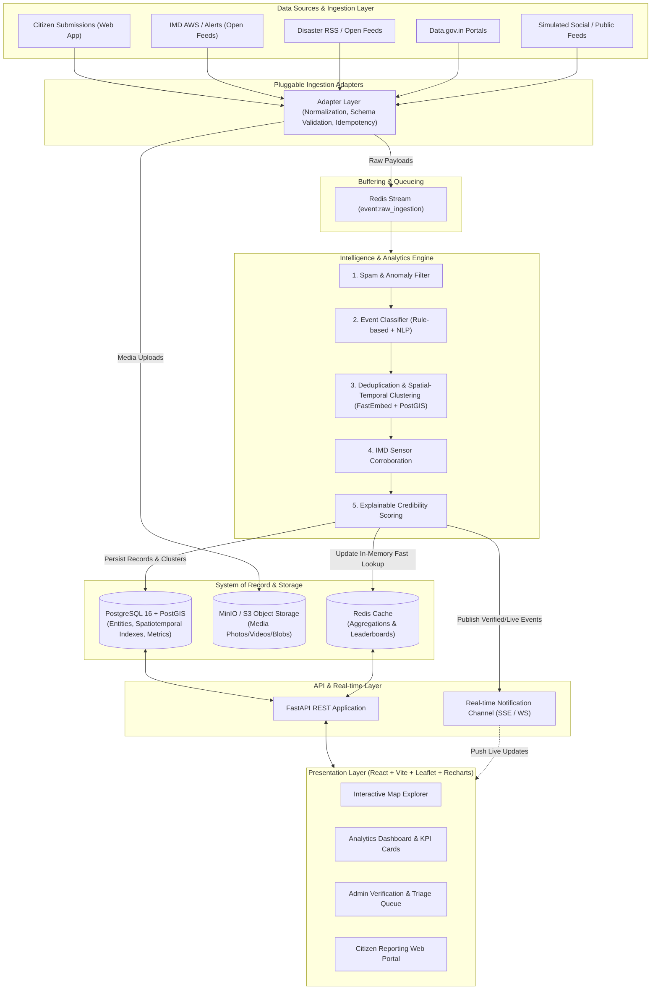
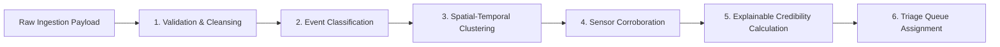
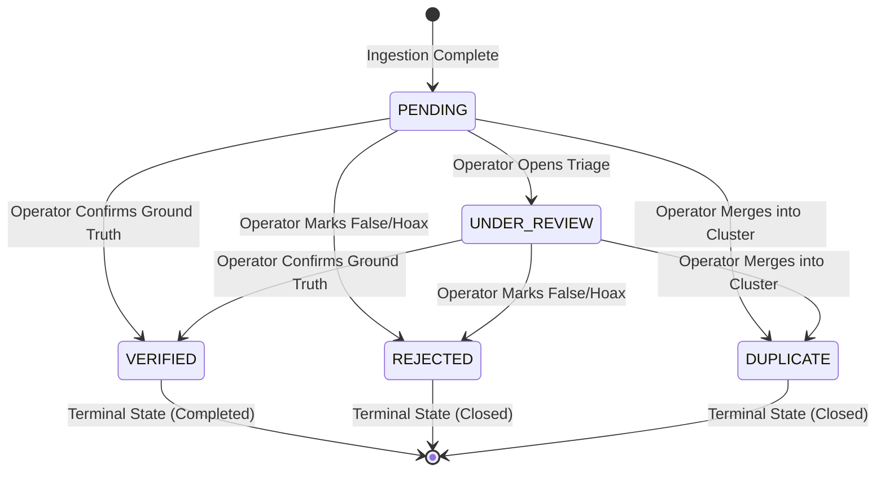
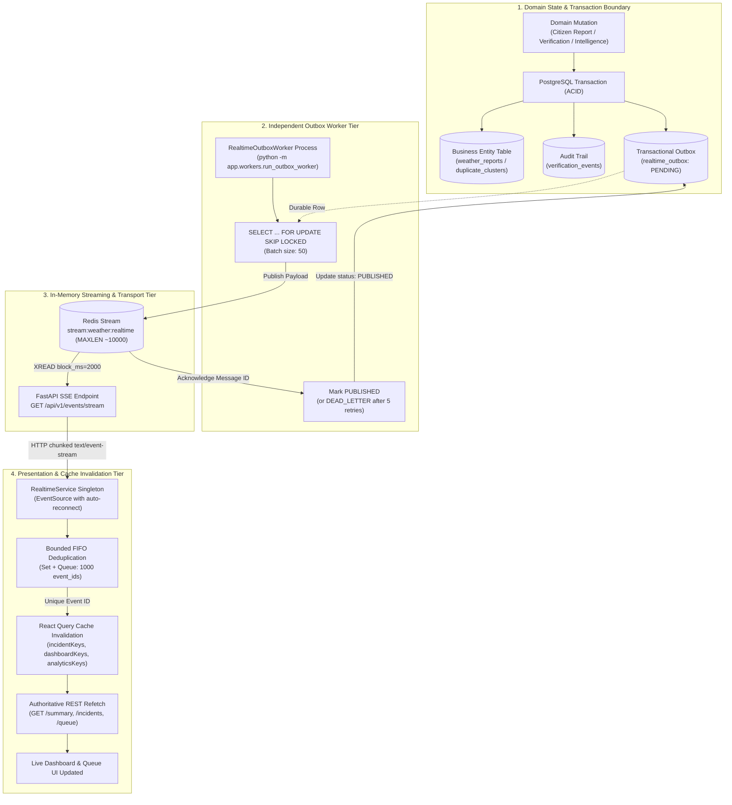

# System Architecture & Technical Design

**Problem Statement ID**: `SIH26069`  
**Platform**: National Weather Big Data Analytics Platform

---

## 1. High-Level Architecture Overview

The system is architected as an asynchronous, event-driven data processing pipeline backed by a high-performance spatial database and modern reactive frontend. 



---

## 2. Ingestion Subsystem (Pluggable Adapters)

To guarantee extensibility across heterogeneous data feeds, all ingestion modules implement a standardized `BaseIngestionAdapter` interface.

```
back-end/app/ingestion/
├── base.py              # BaseIngestionAdapter abstract interface
├── registry.py          # Adapter registration and discovery
├── citizen/             # Citizen crowdsourced submissions
├── imd/                 # India Meteorological Department API / AWS scraper
├── rss/                 # National Disaster Management & Weather RSS feeds
├── data_gov/            # Data.gov.in open weather data integration
└── seed_demo/           # Deterministic demo generator for testing & demonstrations
```

### Integration Status Matrix

| Source Category | Integration Status | Protocol / Format | Polling / Push | Error Handling Strategy |
| :--- | :--- | :--- | :--- | :--- |
| **Citizen Reports** | **REAL INTEGRATION** | HTTP `multipart/form-data` | Real-time Push | Immediate client validation + async queuing |
| **IMD AWS / Alerts** | **REAL INTEGRATION** | HTTP REST / JSON / XML | Periodic Polling (5–15 min) | Exponential backoff with local fallback cache |
| **Public RSS Feeds** | **REAL INTEGRATION** | XML / Atom / GeoRSS | Periodic Polling (10 min) | Idempotent GUID deduplication |
| **Data.gov.in** | **PLANNED INTEGRATION** | OGD Platform API (JSON) | Hourly Polling | Rate-limited polling with API key rotation |
| **Social Media Feeds** | **DEMO/SEED SOURCE** | Synthetic JSON Generator | Event-driven simulation | Seed stream labeled as synthetic |

---

## 3. Intelligence Pipeline Architecture

The intelligence pipeline processes incoming reports sequentially before committing finalized state to the database:



### Step 1: Validation & Cleansing
- Geospatial boundary checks (valid lat/long coordinates within Indian territory `[6.0, 68.0]` to `[38.0, 98.0]`).
- Time sanity checks (rejection of timestamps skewed $> 24\text{ hours}$ in future or $> 7\text{ days}$ in past).
- Media file integrity validation (MIME sniffing, file size limit $\le 15\text{ MB}$, SHA-256 hash).

### Step 2: Event Classification
- Multi-hazard taxonomy assignment:
  - `FLOOD_WATERLOGGING`
  - `THUNDERSTORM_LIGHTNING`
  - `CYCLONE_HIGH_WIND`
  - `HEAVY_RAINFALL`
  - `LANDSLIDE`
  - `HEATWAVE`
  - `HAILSTORM`
  - `OTHER_SEVERE`
- Hybrid classification: Rule-based keyword engine combined with lightweight vector similarity.

### Step 3: Spatial-Temporal Deduplication & Clustering
- Spatial window: radius $R \le 2.5\text{ km}$ via PostGIS `ST_DWithin`.
- Temporal window: time difference $\Delta T \le 120\text{ minutes}$.
- Text semantic similarity: Cosine distance $< 0.25$ over FastEmbed vector embeddings.
- Matching reports are grouped into a `duplicate_clusters` entity with a designated primary report.

### Step 4: Meteorological Corroboration
- Spatial query for the nearest IMD Automatic Weather Station (AWS) within a $25\text{ km}$ radius.
- Corroboration check: If citizen reports heavy rain ($> 30\text{ mm/hr}$) and the nearest AWS records $> 20\text{ mm/hr}$ precipitation within $\pm 2\text{ hours}$, boost corroboration confidence.

### Step 5: Explainable Credibility Scoring Algorithm
Credibility is calculated as a deterministic, mathematically bounded composite score ($C \in [0.0000, 0.9800]$):

1. **Base Trust Prior Anchor ($B$)**:
   $$B = w_{\text{prior}} S_{\text{prior}} + w_{\text{qual}} S_{\text{qual}}$$
   Anchored on source family reliability ($S_{\text{prior}} \in [0.40, 1.00]$) and report quality ($S_{\text{qual}}$).

2. **External Corroboration Support ($S_{\text{support}}$)**:
   $$S_{\text{support}} = \min\left(1.0, 0.30 S_{\text{crowd}} + 0.50 S_{\text{evidence}} + 0.50 S_{\text{observation}}\right)$$
   - $S_{\text{crowd}} \in [0.0, 1.0]$: Crowd volume signal with diminishing returns ($1.0 - \exp(-(k - 1) / 3.0)$ for $k$ cluster members).
   - $S_{\text{evidence}} \in [0.0, 1.0]$: Grouped digital evidence score with logarithmic diminishing returns per provenance group ($1.0 + 0.20 \ln(1 + \text{count} - 1)$).
   - $S_{\text{observation}} \in [0.0, 1.0]$: Physical sensor corroboration from nearby IMD Automatic Weather Stations and CWC river gauges.

3. **Multi-Source Diversity Multiplier ($D$)**:
   $$D = 1.0 + 0.06 \times (n_{\text{independent\_families}} - 1)$$
   Calculated across participating distinct source families (`CITIZEN`, `IMD_AWS`, `CWC_GAUGE`, `NEWS_GDELT`, `NDMA_SACHET`, `SOCIAL_MASTODON`).

4. **Corroboration Lift ($\Delta$) & Bounded Ceiling**:
   $$\Delta = (1.0 - B) \times \min\left(1.0, S_{\text{support}} \times D\right)$$
   $$C = \min\left(B + \Delta - P_{\text{contradiction}}, 0.9800\right)$$

The response payload exposes the exact driver breakdown and uncertainty flags in a structured `credibility_explanation` document.

### Step 6: Verification State Machine



---

## 4. Centralized Storage Architecture

```
┌─────────────────────────────────────────────────────────────┐
│                    PostgreSQL 16 + PostGIS                  │
│  - System of Record                                         │
│  - Spatial Geometry Columns (SRID 4326)                     │
│  - GiST Indexes for Ultra-Fast Proximity Queries            │
│  - Full Relational Integrity (Foreign Keys, Constraints)    │
└─────────────────────────────────────────────────────────────┘
                               ▲
                               │ Metadata & S3 Keys
                               ▼
┌─────────────────────────────────────────────────────────────┐
│                MinIO / S3 Object Storage                    │
│  - Citizen Incident Photos (JPEG, PNG, WebP)                │
│  - Video Clips (MP4, WebM)                                  │
│  - Raw Unstructured Satellite / Radar Raster Artifacts      │
└─────────────────────────────────────────────────────────────┘
                               ▲
                               │ Invalidation / Streams
                               ▼
┌─────────────────────────────────────────────────────────────┐
│                  Redis 7+ (In-Memory Tier)                  │
│  - Redis Streams (event buffer for async worker consumers)  │
│  - Spatial Geohash Caching for Map Tile Rendering           │
│  - Real-time Pub/Sub for Server-Sent Events (SSE)           │
└─────────────────────────────────────────────────────────────┘
```

---

## 5. Canonical Real-Time Outbox & SSE Streaming Architecture

The platform implements an asynchronous, transactional outbox pattern paired with Redis Streams and Server-Sent Events (SSE) to broadcast live state mutations to connected operator dashboards with at-least-once reliability and client-side deduplication.

### 5.1 Architecture & End-to-End Data Flow



---

### 5.2 Component Separation & Technical Rationale

1. **Why PostgreSQL Transactional Outbox?**
   - **Guaranteed Consistency**: The business state mutation (`weather_reports`), the audit log (`verification_events`), and the outbox record (`realtime_outbox`) commit atomically in a single PostgreSQL transaction.
   - **Zero Ghost Events**: If the database transaction rolls back, the outbox record is rolled back automatically. No event is ever published for an uncommitted mutation.
   - **Decoupled Transport**: Eliminates fragile distributed two-phase commit (2PC) between PostgreSQL and Redis.

2. **Why Dedicated Outbox Worker Process?**
   - **Separation of Web & Worker**: Web request handlers never block on external stream publishing. Worker runs in an independent process (`python -m app.workers.run_outbox_worker`).
   - **Horizontal Multi-Worker Scaling**: Multiple worker replicas concurrently query `realtime_outbox` using `SELECT ... FOR UPDATE SKIP LOCKED`, preventing lock contention and duplicate claims.
   - **Self-Healing Backlog Draining**: Drains high-volume bursts with adaptive immediate iteration; sleeps when idle without CPU busy-spinning.

3. **Why Redis Streams (`stream:weather:realtime`)?**
   - **Ordered In-Memory Buffer**: Messages are strictly sequential with millisecond timestamp IDs (e.g., `1788095860922-0`).
   - **Native Historical Replay**: Supports `XRANGE` and `XREAD` for client reconnection replay without hitting PostgreSQL.
   - **Bounded Memory Profile**: Capped with approximate trimming (`MAXLEN ~ 10000`) to guarantee a stable in-memory footprint.

4. **Why Server-Sent Events (SSE)?**
   - **Lightweight Unidirectional Push**: Perfect match for server-to-client telemetry feeds over standard HTTP/1.1 and HTTP/2 without WebSocket connection negotiation overhead.
   - **Native Browser Semantics**: Standard browser `EventSource` handles reconnection automatically and transmits the `Last-Event-ID` header.
   - **Proxy Resilience**: Standard HTTP headers (`X-Accel-Buffering: no`, `Cache-Control: no-cache, no-transform`) ensure compatibility with reverse proxies and CDNs.

5. **Why Centralized Frontend `RealtimeService` & React Query Invalidation?**
   - **Single Shared Socket**: Root-level singleton prevents duplicate SSE connections across page navigations.
   - **Bounded Deduplication**: Maintains an in-memory FIFO ring buffer ($N = 1000$) of seen `event_id` strings to filter duplicate stream frames.
   - **Authoritative REST Refetch**: Realtime events do not mutate client state directly; they invalidate specific React Query cache keys (`incidentKeys.detail(id)`, `dashboardKeys.all`, `analyticsKeys.all`), triggering immediate background refetches from authoritative REST endpoints.

---

### 5.3 Delivery Guarantees & Retention Semantics

- **Delivery Guarantee**: **At-Least-Once Delivery**. Network interruptions or worker restarts before database status commits may result in duplicate event transmission. The frontend suppresses duplicate deliveries for event IDs retained in its bounded deduplication buffer. The system does not guarantee exactly-once delivery or processing.
- **ID Separation**:
  - `event_id` (UUID): Unique, immutable application event identifier generated at outbox creation; remains stable across worker retries and SSE replays.
  - SSE `id` (Redis sequence): Temporal stream cursor (e.g., `1788095860922-0`) used strictly for stream positioning and `Last-Event-ID` replay.
- **Retention Comparison**:
  - **PostgreSQL Outbox Retention**: **72 hours** (`OUTBOX_WORKER_RETENTION_HOURS = 72`). Historical `PUBLISHED` rows older than 72 hours are pruned periodically. `DEAD_LETTER` rows are retained indefinitely.
  - **Redis Stream Retention**: **~10,000 entries** (`REALTIME_STREAM_MAXLEN = 10000`). Bounded by count, not wall-clock time. If a disconnected client reconnects with an ID older than the stream head, the server emits `system.resync_required`.

---

### 5.4 Failure & Recovery Matrix

| Failure Mode | Direct System Impact | Automated Recovery Mechanism |
| :--- | :--- | :--- |
| **PostgreSQL Transaction Rollback** | Mutation aborted. | Outbox row is rolled back with the transaction. Zero events emitted. |
| **Redis Outage / Unreachable** | DB commit succeeds; `xadd` fails. | Worker records `last_error`, applies exponential backoff ($\min(300, 2^{\text{attempts}})\text{ s}$), and updates `next_retry_at`. Retries on subsequent loop. |
| **Outbox Worker Crash** | Worker process dies mid-batch. | PostgreSQL transaction rolls back uncommitted status updates. Restarted worker resumes pending rows using stable `event_id`. |
| **Redis Stream Trimmed (Stale Client)** | Disconnected client reconnects with expired `Last-Event-ID`. | SSE endpoint detects cursor mismatch and emits `system.resync_required`. Frontend invalidates all query caches and re-fetches full REST snapshots. |
| **Client Network Disconnection** | TCP socket drops. | Native browser `EventSource` automatically attempts reconnection, supplying `Last-Event-ID` to replay missed events. |
| **Browser Offline Mode** | Network lost completely. | `RealtimeService` traps `window.offline` event, closes dangling socket, and reconnects cleanly on `window.online`. |
| **Max Retry Exceeded** | Outbox event fails 5 consecutive times. | Row transitions to `DEAD_LETTER` status. Error details preserved in `last_error` for operator inspection. Never pruned. |

---

## 6. Frontend Presentation Architecture

The user interface is engineered as an enterprise-grade disaster intelligence platform built with React, Vite, Tailwind CSS, and shadcn/ui.

### Planned Application Screens

```
front-end/src/pages/
├── 1. Landing / Public Overview        (Home, current national weather bulletin, CTA)
├── 2. Citizen Report Portal            (Mobile-friendly report submission form with map pin)
├── 3. Report Status & Tracking         (Tracking reference view, processing status)
├── 4. Main Disaster Dashboard          (KPI metrics, regional severity breakdown, live feed)
├── 5. Interactive Map Explorer         (Leaflet GIS map, heatmaps, layer toggles, cluster pins)
├── 6. Incident Detail View             (Deep dive, media viewer, sensor corroboration, credibility breakdown)
├── 7. Admin Authentication             (Secure login with MFA and role verification)
├── 8. Admin Verification Queue         (Triage backlog with bulk filtering and urgency ranking)
├── 9. Admin Review & Triage Detail     (Side-by-side evidence inspection, verification action panel)
├── 10. Analytics & Trend Analysis      (Recharts historical trends, seasonal flood curves, hazard frequency)
└── 11. System Health & Sources Status  (Data pipeline latency, adapter uptime, error telemetry)
```
