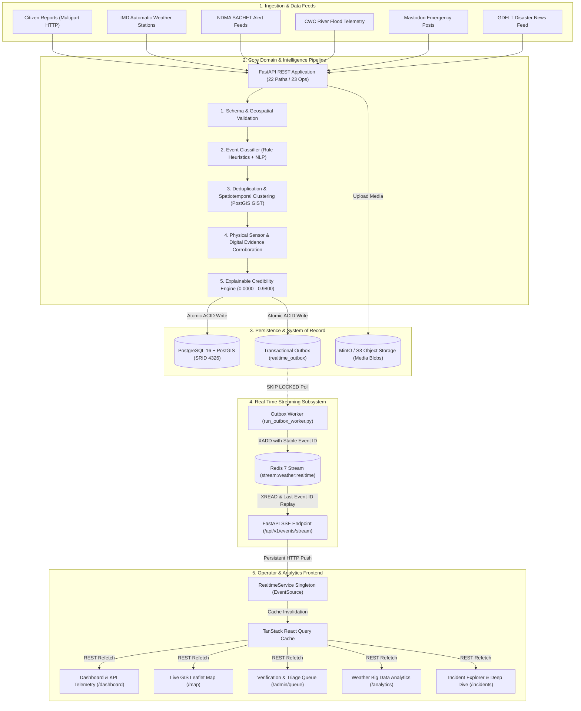
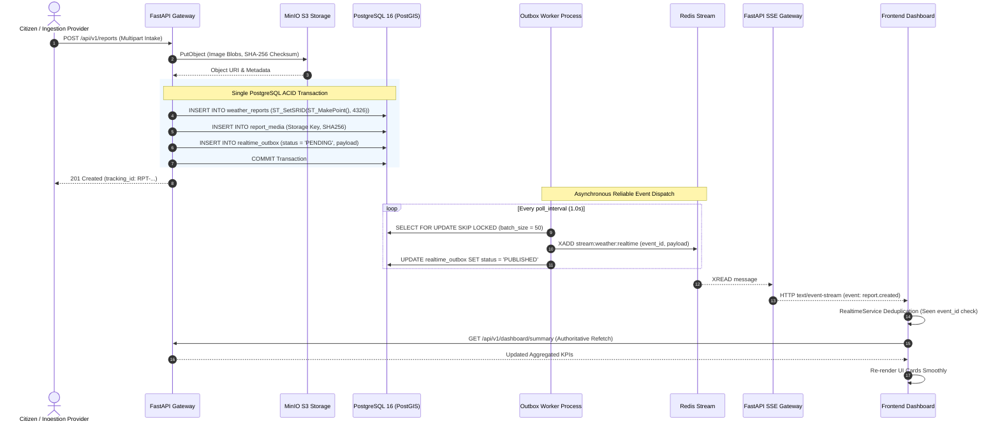
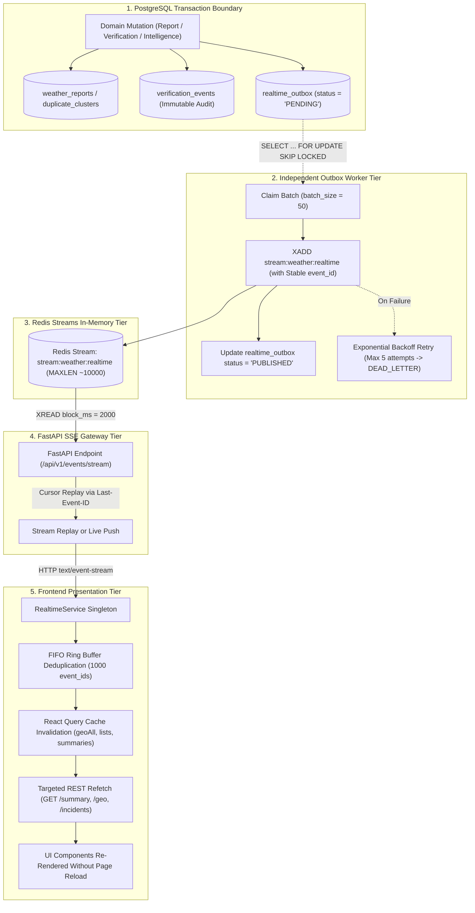
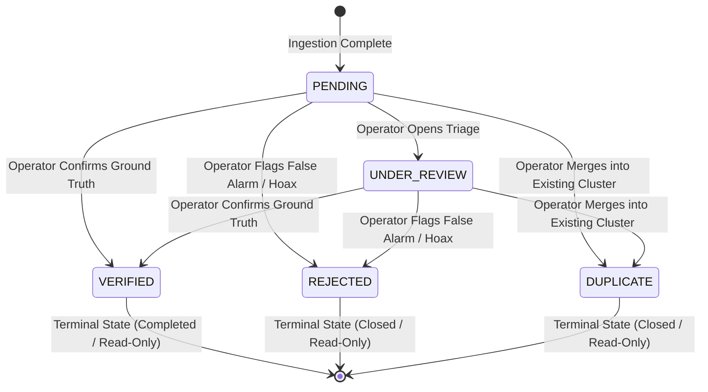

# System Architecture & Technical Design

**Problem Statement ID**: `SIH26069`
**Platform**: National Weather Big Data Analytics Platform
**Status**: **FROZEN FOR SIH/MVP SCOPE** (Baseline: `faa14cd`)

---

## 1. System Overview & End-to-End Flow

The platform is architected as an asynchronous, event-driven data processing pipeline backed by a high-performance spatial database (PostgreSQL 16 + PostGIS) and a reactive presentation layer (React 18 + Leaflet + TanStack Query).



---

## 2. Layered Architecture & Component Ownership

```
┌─────────────────────────────────────────────────────────────────────────────┐
│ 1. PRESENTATION LAYER (front-end/src/)                                      │
│ - Pages: Dashboard, LiveMap, Analytics, VerificationQueue, IncidentDetail   │
│ - State: TanStack Query v5 (Server Cache), RealtimeService (SSE Singleton)  │
│ - Responsibility: Pure UI rendering, filter coordination, lazy REST fetch  │
│ - Boundary: NEVER recalculates credibility, cluster math, or spatial radius │
├─────────────────────────────────────────────────────────────────────────────┤
│ 2. API & GATEWAY LAYER (back-end/app/api/v1/)                               │
│ - Routers: reports, incidents, verification, geo, dashboard, analytics, SSE │
│ - Validation: Strict Pydantic v2 schemas and query parsing                  │
│ - Responsibility: Route handling, error mapping, transaction lifecycle      │
│ - Boundary: No raw SQL string generation; delegates to Service layer        │
├─────────────────────────────────────────────────────────────────────────────┤
│ 3. DOMAIN & INTELLIGENCE SERVICE LAYER (back-end/app/services/)             │
│ - Services: IncidentService, CredibilityEngine, DuplicateDetectionService,  │
│             ObservationCorroboration, EvidenceLinking, AnalyticsService     │
│ - Responsibility: Multi-factor scoring, PostGIS clustering, outbox creation │
│ - Boundary: Stateless business logic executed within async DB sessions      │
├─────────────────────────────────────────────────────────────────────────────┤
│ 4. REALTIME WORKER & STREAMING TIER (back-end/app/workers/)                 │
│ - Process: Dedicated Outbox Worker (run_outbox_worker.py)                   │
│ - Message Broker: Redis 7 Stream (stream:weather:realtime, MAXLEN ~10000)   │
│ - Transport: FastAPI SSE (/api/v1/events/stream)                            │
│ - Responsibility: Reliable event relay, backoff retry, client replay        │
│ - Boundary: At-least-once push; does not mutate business domain state       │
├─────────────────────────────────────────────────────────────────────────────┤
│ 5. PERSISTENCE & STORAGE TIER (PostgreSQL 16 + PostGIS + MinIO)             │
│ - System of Record: PostgreSQL 16 with PostGIS extension (SRID 4326)        │
│ - Object Store: MinIO S3-compatible bucket (weather-media)                  │
│ - Reliability: Transactional Outbox (realtime_outbox table)                 │
│ - Boundary: Foreign key constraints, PostGIS spatial indexing, ACID safety  │
└─────────────────────────────────────────────────────────────────────────────┘
```

---

## 3. Transaction Boundaries & Intelligence Pipeline



---

## 4. Real-Time Outbox Subsystem

The real-time subsystem decouples domain database transactions from external streaming transports using the Transactional Outbox pattern paired with Redis Streams and Server-Sent Events (SSE).

### 4.1 End-to-End Data Flow



### 4.2 Architectural Rationale

1. **Why PostgreSQL Transactional Outbox?**
   - **Guaranteed Consistency**: Business entity mutations, audit logs, and outbox staging records commit together in a single ACID transaction.
   - **Zero Ghost Events**: If a transaction rolls back, the outbox record is discarded. No event is ever published for an uncommitted mutation.
   - **Elimination of Distributed Transactions**: Removes fragile distributed two-phase commits (2PC) between PostgreSQL and Redis.

2. **Why Dedicated Outbox Worker Process (`run_outbox_worker.py`)?**
   - **Web Request Decoupling**: API request handlers never block on external network I/O or Redis publish latency.
   - **Horizontal Multi-Worker Scaling**: Multiple worker replicas query `realtime_outbox` concurrently using `SELECT ... FOR UPDATE SKIP LOCKED`, preventing lock contention and duplicate message claiming.
   - **Self-Healing Backlog Draining**: Continues loop execution immediately when `published_count > 0` to drain backlogs rapidly before sleeping.

3. **Why Redis Streams (`stream:weather:realtime`)?**
   - **Ordered Sequence**: Messages possess monotonically increasing millisecond sequence IDs (e.g., `1788095860922-0`).
   - **Native Replay**: Enables historical cursor replay via `XREAD` using the browser's `Last-Event-ID`.
   - **Bounded Memory Profile**: Capped with approximate trimming (`MAXLEN ~ 10000`) to guarantee a stable in-memory footprint.

4. **Why Server-Sent Events (SSE)?**
   - **Lightweight Unidirectional Push**: Eliminates WebSocket handshake and bidirectional protocol overhead for dashboard telemetry.
   - **Native Browser Semantics**: Standard `EventSource` handles reconnection automatically and transmits `Last-Event-ID`.
   - **Proxy Resilience**: Headers (`X-Accel-Buffering: no`, `Cache-Control: no-cache, no-transform`) ensure compatibility with reverse proxies.

5. **Why React Query Invalidation over Direct Client State Mutation?**
   - **Authoritative Single Source of Truth**: Events act as lightweight triggers. The frontend refetches authoritative, canonical JSON payloads from REST endpoints, preventing client-side state divergence.
   - **Bounded Deduplication**: `RealtimeService` maintains a FIFO set of 1,000 seen `event_id` strings to suppress duplicate frames.

---

## 5. Worker Architecture & Operational Configuration

The background outbox worker is implemented in [app/workers/outbox_worker.py](file:///Users/akshatjain/Documents/SIH/back-end/app/workers/outbox_worker.py) and executed via [app/workers/run_outbox_worker.py](file:///Users/akshatjain/Documents/SIH/back-end/app/workers/run_outbox_worker.py).

```
python -m app.workers.run_outbox_worker
```

### 5.1 Worker Configuration Defaults (from `app/core/config.py`)

| Configuration Key | Default Value | Description |
| :--- | :--- | :--- |
| `OUTBOX_WORKER_ENABLED` | `True` | Master switch enabling the worker poll loop |
| `OUTBOX_WORKER_BATCH_SIZE` | `50` | Number of pending outbox rows claimed per transaction |
| `OUTBOX_WORKER_POLL_INTERVAL_SECONDS` | `1.0` | Polling loop interval / sleep duration when no rows are pending |
| `OUTBOX_WORKER_MAX_ATTEMPTS` | `5` | Maximum delivery attempts before row is marked `DEAD_LETTER` |
| `OUTBOX_WORKER_PRUNE_INTERVAL_SECONDS` | `3600` | Periodic pruning frequency for published rows |
| `OUTBOX_WORKER_RETENTION_HOURS` | `72` | Retention window for `PUBLISHED` rows before automated pruning |
| `REALTIME_STREAM_NAME` | `stream:weather:realtime` | Redis Stream topic name for realtime event delivery |
| `REALTIME_STREAM_MAXLEN` | `10000` | Maximum approximate stream buffer length |

### 5.2 Worker Lifecycle & Error Handling
- **Batch Claiming**: Uses `SELECT * FROM realtime_outbox WHERE status = 'PENDING' AND (next_retry_at IS NULL OR next_retry_at <= NOW()) ORDER BY created_at ASC LIMIT :batch_size FOR UPDATE SKIP LOCKED`.
- **Exponential Retry Backoff**: When a Redis publish fails, attempts counter increments and retry delay is computed as: $\text{delay} = \min(300, 2^{\text{attempts}})\text{ seconds}$.
- **Dead-Letter Preservation**: After reaching `max_attempts` (default 5), the row status transitions to `DEAD_LETTER` and is preserved indefinitely with `last_error` for operator inspection.
- **Periodic Pruning**: Every `OUTBOX_WORKER_PRUNE_INTERVAL_SECONDS` (3600s), removes `PUBLISHED` rows where `published_at` is older than `OUTBOX_WORKER_RETENTION_HOURS` (72 hours).
- **Graceful Signal Handling**: Traps `SIGTERM` and `SIGINT`, finishing the active in-flight batch before cleanly releasing database and Redis connection pools.

---

## 6. Geospatial Map Architecture

The platform provides two primary map views: the **Executive Dashboard Map** (`/dashboard`) and the **Fullscreen Live GIS Map** (`/map`).

```
┌─────────────────────────────────────────────────────────────┐
│ 1. BOUNDED GEOJSON VECTOR ENDPOINT (GET /api/v1/geo/incidents)│
│ - Spatial Point Geometry (SRID 4326)                        │
│ - Hard Server-Side Bound: LIMIT 500 features                │
│ - Safe Handling: Reports with null coordinates are excluded │
│ - Optional Viewport Bounding Box: min_lon,min_lat,max_lon,max_lat │
└─────────────────────────────────────────────────────────────┘
                               ▲
                               │ HTTP GET (TanStack Query: incidentKeys.geoAll)
                               ▼
┌─────────────────────────────────────────────────────────────┐
│ 2. FRONTEND ADAPTER LAYER (front-end/src/features/map/adapters.ts) │
│ - Function: geoJSONToMapPoints(featureCollection)           │
│ - Converts GeoJSON Features to Leaflet MapIncidentPoint     │
│ - Extracts coordinates, severity, category, credibility     │
└─────────────────────────────────────────────────────────────┘
                               ▲
                               │ User Clicks Marker
                               ▼
┌─────────────────────────────────────────────────────────────┐
│ 3. LAZY DETAIL LOADING & RESILIENCE (LiveMapPage.tsx)       │
│ - On Marker Selection: Lazy query GET /api/v1/incidents/{id}│
│ - Fallback Resilience: If detail fetch fails (e.g. 500 error),│
│   map remains fully usable with basic point data; no crash. │
└─────────────────────────────────────────────────────────────┘
```

### Authoritative Aggregate Counts vs Map Features
- **Map Features (Bounded Sample)**: Map markers represent a bounded situational sample (up to 500 points) to guarantee 60 FPS browser rendering performance.
- **Authoritative Aggregate Counts**: National and regional macro totals (Total Reports, Verified, Under Review, High Severity) are computed strictly on the server via `GET /api/v1/dashboard/summary` across the entire database population.
- **Frontend Query Consumer Semantics**:
  - `fetchAllDashboardReports`: Deprecated and completely removed during the Step 13E GeoJSON migration; zero remaining consumers exist in the codebase.
  - `fetchReportList`: Intentionally retained in `front-end/src/services/reportApi.ts` for `AdminVerificationQueuePage` (`/admin/queue`) to power the paginated, filterable operator triage table via `GET /api/v1/reports`.

---

## 7. Analytics & Aggregation Architecture

The analytics platform (`/analytics`) operates strictly on server-side SQL aggregations to eliminate heavy client-side calculation loops.

```
┌─────────────────────────────────────────────────────────────┐
│ 1. DASHBOARD SUMMARY (GET /api/v1/dashboard/summary)         │
│ - Aggregates total volume, verified rate, under review      │
│ - Computes diurnal distribution and category breakdown      │
│ - Cache Key: dashboardKeys.summary(filters)                 │
├─────────────────────────────────────────────────────────────┤
│ 2. TEMPORAL TRENDS (GET /api/v1/analytics/trends)           │
│ - SQL time-bucketed progression across 24h, 7d, 30d, all-time│
│ - Returns volume, verification progress, and incident rate  │
│ - Cache Key: analyticsKeys.trends(filters)                  │
├─────────────────────────────────────────────────────────────┤
│ 3. REGIONAL DEMOGRAPHICS (GET /api/v1/analytics/regional)   │
│ - Two-Tier Aggregation: Word-boundary city/state tokens with│
│   spatial PostGIS bounding envelope fallback                │
│ - Cache Key: analyticsKeys.regional(filters)                │
└─────────────────────────────────────────────────────────────┘
```

---

## 8. Verification & Triage State Machine

The verification subsystem manages the operational lifecycle of weather reports through immutable audit events.



### Transition Enforcement Rules
- **Terminal States**: `VERIFIED`, `REJECTED`, and `DUPLICATE` are permanent terminal states. Once an incident reaches a terminal state, subsequent mutation requests return `HTTP 409 Conflict` or are rejected by the state machine.
- **Immutable Audit Logging**: Every transition inserts a record into `verification_events` capturing `user_id`, `previous_status`, `new_status`, `notes`, and `action_metadata`.
- **Transactional Real-Time Emission**: Each transition atomically stages an outbox row (`report.verification_changed`), triggering immediate live dashboard updates.

---

## 9. Failure & Recovery Model Matrix

| Failure Mode | System Impact | Automated Recovery Mechanism | User-Visible Effect |
| :--- | :--- | :--- | :--- |
| **PostgreSQL DB Crash / Outage** | API mutations and queries fail. | Database connection pool retries; FastAPI returns `HTTP 500/503`. | Error alert rendered; retry banner displayed. |
| **Redis Outage / Unreachable** | Realtime stream unavailable; outbox worker pauses publish. | Outbox worker enters exponential backoff ($\le 300\text{ s}$); mutations remain safely staged in PostgreSQL `realtime_outbox`. | UI falls back to manual refresh; live updates pause. |
| **Outbox Worker Process Stopped** | Realtime SSE broadcast halts. | Pending outbox rows accumulate safely in PostgreSQL. Upon worker restart, backlog drains automatically. | Live dashboard updates pause until worker process is restarted. |
| **SSE Network Disconnection** | EventSource connection drops. | Browser native `EventSource` automatically reconnects with `Last-Event-ID` header. | Reconnection indicator displayed; missed events replayed. |
| **Redis Stream Trimmed (Stale Client)** | Disconnected client reconnects with pruned `Last-Event-ID`. | SSE endpoint detects missing ID and emits `system.resync_required`. | Frontend automatically invalidates all caches and refetches fresh REST data. |
| **Leaflet Marker Detail Fetch Failure** | Marker detail request returns 500. | React Query catches error; LiveMap retains lightweight point data. | Marker popup displays basic info; error fallback banner shown; map does not crash. |
| **Duplicate Verification Action** | Operator attempts to re-verify terminal report. | State machine rejects transition with `HTTP 409 Conflict`. | UI displays warning banner indicating incident is already closed. |

---

## 10. Understanding the System (Study & Viva Reference)

- **What problem does the product solve?**
  Bridges the critical gap between high-altitude meteorological feeds (IMD radar/AWS) and localized ground realities (urban waterlogging, flash floods, landslides) during disasters by ingesting, deduplicating, corroborating, and scoring citizen reports alongside official telemetry.
- **What happens when a report is submitted?**
  The report is validated, media is saved to MinIO, and a PostgreSQL transaction atomically inserts `weather_reports` and a `realtime_outbox` event. The async intelligence pipeline then classifies the hazard, clusters co-located duplicates, checks proximate IMD weather stations, links digital news evidence, computes explainable credibility ($0.0000$–$0.9800$), and emits live updates.
- **Why PostgreSQL + PostGIS?**
  PostGIS provides native spatial data types (`GEOMETRY(Point, 4326)`) and GiST spatial indexes enabling microsecond spatial proximity queries (`ST_DWithin`) across millions of records.
- **Why Transactional Outbox + Redis Streams?**
  Guarantees zero ghost events (events are only emitted if the DB transaction succeeds) without distributed 2PC locking, while Redis Streams provides ordered in-memory buffering and cursor-based replay (`Last-Event-ID`).
- **Why Server-Sent Events (SSE)?**
  Lightweight unidirectional push over standard HTTP with native browser reconnect semantics, avoiding the operational complexity of bidirectional WebSockets.
- **Why Server-Side Analytics?**
  Offloads heavy aggregations and multi-state geospatial grouping to PostgreSQL indexes, ensuring fast client rendering without browser memory degradation.
