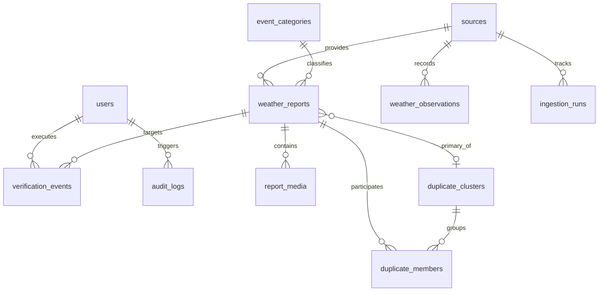

# Data Model & Entity Specifications

**Platform**: National Weather Big Data Analytics Platform (`SIH26069`)  
**Status**: Architectural Design Specification (No SQL migrations executed in initialization phase)

---

## 1. Entity Relationship Overview

---

## 2. Core Entity Definitions

### 2.1 `users`
Represents authorized administrators, disaster management officers (NDRF/SDRF/DEOC), meteorological analysts, and system operators.

| Field Name | Type | Constraints | Description |
| :--- | :--- | :--- | :--- |
| `id` | `UUID` | Primary Key, `gen_random_uuid()` | Unique user identifier |
| `email` | `VARCHAR(255)` | Unique, Not Null, Indexed | Official email address |
| `full_name` | `VARCHAR(150)` | Not Null | User's full legal/display name |
| `hashed_password` | `VARCHAR(255)` | Not Null | Argon2 / bcrypt password hash |
| `role` | `VARCHAR(50)` | Not Null, Default `'DEOC_OFFICER'` | Role (`ADMIN`, `DEOC_OFFICER`, `MET_ANALYST`, `AUDITOR`) |
| `jurisdiction_code`| `VARCHAR(50)` | Nullable | State/District boundary code (e.g., `'IN-MH-MUM'`) |
| `is_active` | `BOOLEAN` | Not Null, Default `TRUE` | Account active state |
| `created_at` | `TIMESTAMPTZ` | Not Null, Default `NOW()` | Account creation timestamp |
| `updated_at` | `TIMESTAMPTZ` | Not Null, Default `NOW()` | Last modification timestamp |

---

### 2.2 `sources`
Catalog of all data providers feeding into the ingestion pipeline.

| Field Name | Type | Constraints | Description |
| :--- | :--- | :--- | :--- |
| `id` | `UUID` | Primary Key | Source identifier |
| `source_code` | `VARCHAR(50)` | Unique, Not Null | Unique code (`'CITIZEN_PORTAL'`, `'IMD_AWS'`, `'RSS_NDMA'`, `'OGD_DATA_GOV'`) |
| `name` | `VARCHAR(150)` | Not Null | Display name of the data source |
| `source_type` | `VARCHAR(50)` | Not Null | Type (`'CITIZEN'`, `'OFFICIAL_MET'`, `'GOV_OPEN_DATA'`, `'RSS'`, `'SEED_DEMO'`) |
| `base_trust_score`| `FLOAT` | Not Null, Range `[0.0, 1.0]` | Baseline trust weight for credibility scoring |
| `is_active` | `BOOLEAN` | Not Null, Default `TRUE` | Whether adapter is currently enabled |
| `config` | `JSONB` | Nullable | Adapter-specific config (polling frequency, base URL, rate limits) |
| `created_at` | `TIMESTAMPTZ` | Not Null, Default `NOW()` | Registration timestamp |

---

### 2.3 `event_categories`
Standardized multi-hazard taxonomy for weather and disaster events.

| Field Name | Type | Constraints | Description |
| :--- | :--- | :--- | :--- |
| `id` | `UUID` | Primary Key | Category identifier |
| `category_code` | `VARCHAR(50)` | Unique, Not Null | Code (`'FLOOD_WATERLOGGING'`, `'THUNDERSTORM'`, `'CYCLONE'`, `'LANDSLIDE'`) |
| `title` | `VARCHAR(100)` | Not Null | Human-readable title |
| `severity_default`| `VARCHAR(20)` | Not Null, Default `'MODERATE'` | Baseline severity level (`'LOW'`, `'MODERATE'`, `'HIGH'`, `'SEVERE'`, `'CRITICAL'`) |
| `color_hex` | `VARCHAR(10)` | Not Null | UI marker/accent color (e.g., `'#EF4444'`) |
| `icon_name` | `VARCHAR(50)` | Not Null | UI icon identifier (e.g., `'cloud-rain'`, `'wind'`) |

---

### 2.4 `weather_reports`
Primary entity representing citizen submissions, crowdsourced observations, and ingested external event items.

| Field Name | Type | Constraints | Description |
| :--- | :--- | :--- | :--- |
| `id` | `UUID` | Primary Key | Unique incident report identifier |
| `tracking_id` | `VARCHAR(32)` | Unique, Not Null, Indexed | Short human-readable tracking code (e.g., `'RPT-20260829-X9K2'`) |
| `source_id` | `UUID` | Foreign Key (`sources.id`), Not Null | Attributed source |
| `external_id` | `VARCHAR(255)` | Nullable, Indexed | Source-provided identifier (e.g., RSS GUID, external report ID) |
| `category_id` | `UUID` | Foreign Key (`event_categories.id`), Nullable | Classified hazard category |
| `reported_category`| `VARCHAR(100)`| Nullable | Citizen-selected category before automated classification |
| `severity` | `VARCHAR(20)` | Not Null, Default `'MODERATE'` | Severity (`'LOW'`, `'MODERATE'`, `'HIGH'`, `'SEVERE'`, `'CRITICAL'`) |
| `title` | `VARCHAR(255)` | Not Null | Brief summary or title |
| `description` | `TEXT` | Nullable | Detailed incident description |
| `location_name` | `VARCHAR(255)` | Nullable | Landmark / street / district address string |
| `geom` | `GEOMETRY(Point, 4326)` | Not Null | PostGIS spatial point `(longitude, latitude)` with GiST spatial index |
| `latitude` | `DOUBLE PRECISION`| Not Null | Redundant decimal latitude for fast serialization |
| `longitude` | `DOUBLE PRECISION`| Not Null | Redundant decimal longitude for fast serialization |
| `occurred_at` | `TIMESTAMPTZ` | Not Null, Indexed | Actual time event occurred |
| `processing_status`| `VARCHAR(30)` | Not Null, Default `'PENDING'` | Pipeline status (`'QUEUED'`, `'PROCESSING'`, `'COMPLETED'`, `'FAILED'`) |
| `verification_status`| `VARCHAR(30)`| Not Null, Default `'PENDING'`, Indexed | Triage status (`'PENDING'`, `'UNDER_REVIEW'`, `'VERIFIED'`, `'REJECTED'`, `'DUPLICATE'`) |
| `credibility_score`| `FLOAT` | Not Null, Default `0.0`, Range `[0.0, 1.0]`, Indexed | Calculated credibility metric |
| `credibility_explanation`| `JSONB` | Nullable | Factor-by-factor scoring breakdown |
| `text_embedding` | `vector(384)` / `FLOAT[]` | Nullable | Text embedding for semantic deduplication |
| `raw_payload` | `JSONB` | Nullable | Full original ingestion payload for audit and reprocessing |
| `created_at` | `TIMESTAMPTZ` | Not Null, Default `NOW()`, Indexed | Ingestion timestamp |
| `updated_at` | `TIMESTAMPTZ` | Not Null, Default `NOW()` | Last update timestamp |

---

### 2.5 `report_media`
Metadata for photographic and video evidence associated with weather reports.

| Field Name | Type | Constraints | Description |
| :--- | :--- | :--- | :--- |
| `id` | `UUID` | Primary Key | Unique media identifier |
| `report_id` | `UUID` | Foreign Key (`weather_reports.id`), On Delete Cascade, Not Null | Associated incident report |
| `media_type` | `VARCHAR(30)` | Not Null | Type (`'IMAGE'`, `'VIDEO'`, `'DOCUMENT'`) |
| `storage_bucket`| `VARCHAR(100)` | Not Null | S3/MinIO bucket name |
| `storage_key` | `VARCHAR(500)` | Not Null | Object storage key/path |
| `mime_type` | `VARCHAR(100)` | Not Null | MIME type (e.g., `'image/jpeg'`, `'video/mp4'`) |
| `file_size_bytes`| `BIGINT` | Not Null | File size in bytes |
| `sha256_hash` | `VARCHAR(64)` | Not Null | SHA-256 hash for deduplication and tamper detection |
| `exif_metadata`| `JSONB` | Nullable | Extracted EXIF data (GPS coordinates, camera model, capture time) |
| `created_at` | `TIMESTAMPTZ` | Not Null, Default `NOW()` | Upload timestamp |

---

### 2.6 `weather_observations`
Official sensor readings collected from IMD Automatic Weather Stations (AWS), radars, and hydrological telemetry.

| Field Name | Type | Constraints | Description |
| :--- | :--- | :--- | :--- |
| `id` | `UUID` | Primary Key | Unique observation record |
| `source_id` | `UUID` | Foreign Key (`sources.id`), Not Null | Attributed sensor source |
| `station_code`| `VARCHAR(50)` | Not Null, Indexed | Official IMD / CWC station identifier |
| `station_name`| `VARCHAR(150)` | Not Null | Station location name |
| `geom` | `GEOMETRY(Point, 4326)` | Not Null | PostGIS station coordinates with GiST index |
| `observed_at` | `TIMESTAMPTZ` | Not Null, Indexed | Measurement timestamp |
| `temperature_c`| `FLOAT` | Nullable | Temperature in Celsius |
| `humidity_pct` | `FLOAT` | Nullable | Relative humidity percentage |
| `rainfall_mm` | `FLOAT` | Nullable | Accumulated rainfall in mm |
| `wind_speed_kmh`| `FLOAT` | Nullable | Wind speed in km/h |
| `wind_direction_deg`| `INTEGER` | Nullable | Wind direction (0-360 degrees) |
| `pressure_hpa`| `FLOAT` | Nullable | Atmospheric pressure in hPa |
| `raw_metrics` | `JSONB` | Nullable | Additional vendor-specific sensor fields |
| `created_at` | `TIMESTAMPTZ` | Not Null, Default `NOW()` | Database record creation timestamp |

---

### 2.7 `duplicate_clusters` & `duplicate_members`
Spatial-temporal grouping entities that cluster co-located, concurrent reports.

#### `duplicate_clusters`
| Field Name | Type | Constraints | Description |
| :--- | :--- | :--- | :--- |
| `id` | `UUID` | Primary Key | Unique cluster identifier |
| `primary_report_id`| `UUID` | Foreign Key (`weather_reports.id`), Not Null | Lead/canonical report representing the cluster |
| `cluster_radius_meters`| `FLOAT` | Not Null, Default `2500` | Spatial bounding radius |
| `centroid_geom`| `GEOMETRY(Point, 4326)` | Not Null | Computed geographic centroid of the cluster |
| `member_count`| `INTEGER` | Not Null, Default `1` | Total count of reports merged into this cluster |
| `created_at` | `TIMESTAMPTZ` | Not Null, Default `NOW()` | Cluster formation timestamp |
| `updated_at` | `TIMESTAMPTZ` | Not Null, Default `NOW()` | Last cluster update timestamp |

#### `duplicate_members`
| Field Name | Type | Constraints | Description |
| :--- | :--- | :--- | :--- |
| `id` | `UUID` | Primary Key | Membership link identifier |
| `cluster_id` | `UUID` | Foreign Key (`duplicate_clusters.id`), On Delete Cascade, Not Null | Associated cluster |
| `report_id` | `UUID` | Foreign Key (`weather_reports.id`), On Delete Cascade, Not Null | Participating report |
| `similarity_score`| `FLOAT` | Not Null | Computed multi-modal similarity score `[0.0, 1.0]` |
| `created_at` | `TIMESTAMPTZ` | Not Null, Default `NOW()` | Membership link timestamp |

---

### 2.8 `verification_events`
Audit trail of human verification and triage decisions performed by authorized officers.

| Field Name | Type | Constraints | Description |
| :--- | :--- | :--- | :--- |
| `id` | `UUID` | Primary Key | Unique verification event identifier |
| `report_id` | `UUID` | Foreign Key (`weather_reports.id`), Not Null | Target report |
| `user_id` | `UUID` | Foreign Key (`users.id`), Not Null | Officer who performed the action |
| `previous_status`| `VARCHAR(30)`| Not Null | Prior status before transition |
| `new_status` | `VARCHAR(30)` | Not Null | Transitioned status (`VERIFIED`, `REJECTED`, `DUPLICATE`) |
| `notes` | `TEXT` | Nullable | Officer's justification / notes |
| `action_metadata`| `JSONB` | Nullable | Action context (IP address, response team dispatch flag) |
| `created_at` | `TIMESTAMPTZ` | Not Null, Default `NOW()` | Action timestamp |

---

### 2.9 `ingestion_runs`
Telemetry records tracking external adapter health, polling runs, success metrics, and network errors.

| Field Name | Type | Constraints | Description |
| :--- | :--- | :--- | :--- |
| `id` | `UUID` | Primary Key | Ingestion execution identifier |
| `source_id` | `UUID` | Foreign Key (`sources.id`), Not Null | Target source adapter |
| `status` | `VARCHAR(30)` | Not Null | Run status (`'RUNNING'`, `'SUCCESS'`, `'FAILED'`, `'PARTIAL'`) |
| `records_fetched`| `INTEGER` | Not Null, Default `0` | Raw records received from provider |
| `records_ingested`| `INTEGER` | Not Null, Default `0` | Clean records inserted into pipeline |
| `records_duplicate`| `INTEGER` | Not Null, Default `0` | Duplicates skipped at ingestion boundary |
| `error_details` | `TEXT` | Nullable | Exception trace or HTTP error message |
| `started_at` | `TIMESTAMPTZ` | Not Null, Default `NOW()` | Polling start timestamp |
| `completed_at` | `TIMESTAMPTZ` | Nullable | Polling completion timestamp |

---

### 2.10 `audit_logs`
System-wide immutable security and operational audit trail.

| Field Name | Type | Constraints | Description |
| :--- | :--- | :--- | :--- |
| `id` | `UUID` | Primary Key | Audit log identifier |
| `user_id` | `UUID` | Foreign Key (`users.id`), Nullable | Actor user ID (null for system automated jobs) |
| `action` | `VARCHAR(100)` | Not Null, Indexed | Action name (e.g., `'USER_LOGIN'`, `'REPORT_VERIFIED'`, `'ADAPTER_RESTARTED'`) |
| `entity_type` | `VARCHAR(50)` | Not Null | Target entity (`'weather_reports'`, `'users'`, `'sources'`) |
| `entity_id` | `UUID` | Nullable | Target entity ID |
| `ip_address` | `VARCHAR(45)` | Nullable | Client IP address |
| `payload` | `JSONB` | Nullable | Diff or state snapshot before/after action |
| `created_at` | `TIMESTAMPTZ` | Not Null, Default `NOW()`, Indexed | Audit event timestamp |

---

## 3. Spatial & Relational Indexing Strategy

1. **Spatial Indexes**:
   - `CREATE INDEX idx_weather_reports_geom ON weather_reports USING GIST (geom);`
   - `CREATE INDEX idx_weather_observations_geom ON weather_observations USING GIST (geom);`
   - `CREATE INDEX idx_duplicate_clusters_centroid ON duplicate_clusters USING GIST (centroid_geom);`
2. **Temporal & Filter Indexes**:
   - `CREATE INDEX idx_weather_reports_status_time ON weather_reports (verification_status, occurred_at DESC);`
   - `CREATE INDEX idx_weather_reports_credibility ON weather_reports (credibility_score DESC);`
   - `CREATE INDEX idx_weather_reports_source_external ON weather_reports (source_id, external_id);`
