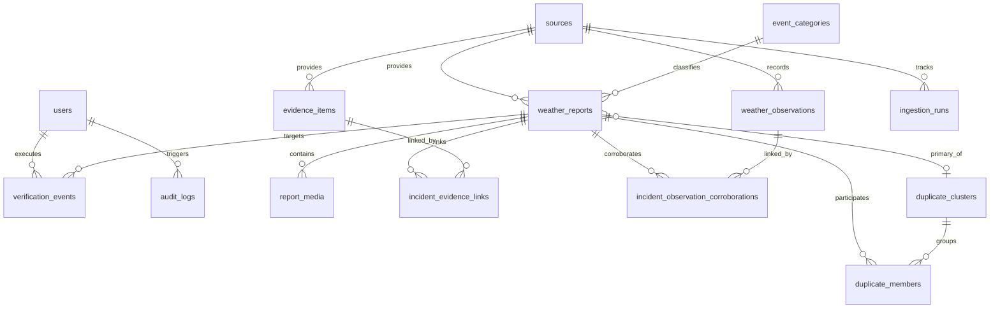

# Data Model & Entity Specifications

**Platform**: National Weather Big Data Analytics Platform (`SIH26069`)
**Status**: **SYNCHRONIZED WITH CURRENT CODE & MIGRATIONS** (Alembic Head: `0004_realtime_outbox_schema`)
**Database**: PostgreSQL 16+ with PostGIS 3.4+ (`SRID 4326`)

---

## 1. Entity Relationship Overview

The database schema consists of **15 authoritative tables** mapped directly from declarative SQLAlchemy models.

---

## 2. Table & Model Mapping Matrix

| Table Name | SQLAlchemy Model | Python Source File | Migration Script | Purpose |
| :--- | :--- | :--- | :--- | :--- |
| `weather_reports` | `WeatherReport` | `app/models/report.py` | `0001_initial_schema` | Core citizen and external incident reports |
| `report_media` | `ReportMedia` | `app/models/media.py` | `0001_initial_schema` | Metadata for photographic/video attachments in MinIO/S3 |
| `sources` | `Source` | `app/models/source.py` | `0001_initial_schema` | Ingestion sources and baseline trust weights |
| `event_categories` | `EventCategory` | `app/models/category.py` | `0001_initial_schema` | Official hazard categories and severity defaults |
| `duplicate_clusters`| `DuplicateCluster`| `app/models/duplicate.py` | `0001_initial_schema` | Spatial-temporal clusters of duplicate reports |
| `duplicate_members` | `DuplicateMember` | `app/models/duplicate.py` | `0001_initial_schema` | Membership association and semantic similarity |
| `verification_events`| `VerificationEvent`| `app/models/verification.py`| `0001_initial_schema` | Immutable operator triage audit log |
| `audit_logs` | `AuditLog` | `app/models/audit.py` | `0001_initial_schema` | Platform-wide operational audit records |
| `users` | `User` | `app/models/user.py` | `0001_initial_schema` | System users and institutional roles |
| `ingestion_runs` | `IngestionRun` | `app/models/ingestion.py` | `0001_initial_schema` | Ingestion execution logs and record counts |
| `weather_observations`| `WeatherObservation`| `app/models/observation.py`| `0002_evidence_and_corroboration_schema`| Physical sensor and hydrological station metrics |
| `evidence_items` | `EvidenceItem` | `app/models/evidence.py` | `0002_evidence_and_corroboration_schema`| Digital news articles, social posts, and alerts |
| `incident_evidence_links`| `IncidentEvidenceLink`| `app/models/evidence.py`| `0002_evidence_and_corroboration_schema`| Association between incidents and evidence items |
| `incident_observation_corroborations`| `IncidentObservationCorroboration`| `app/models/corroboration.py`| `0002_evidence_and_corroboration_schema`| Physical sensor proximity corroborations |
| `realtime_outbox` | `RealtimeOutbox` | `app/models/outbox.py` | `0004_realtime_outbox_schema` | Transactional outbox for guaranteed event staging |

---

## 3. Core Entity Schema Definitions

### 3.1 `weather_reports`
Primary domain entity for citizen submissions and normalized external incident events.

| Column | Type | Constraints | Description |
| :--- | :--- | :--- | :--- |
| `id` | `UUID` | Primary Key, `gen_random_uuid()` | Unique report identifier |
| `tracking_id` | `VARCHAR(32)` | Unique, Not Null, Indexed | Human-readable public tracking code (`RPT-...`) |
| `source_id` | `UUID` | Foreign Key (`sources.id`), Not Null | Origin source identifier |
| `external_id` | `VARCHAR(255)` | Nullable, Indexed | External provider GUID / record identifier |
| `category_id` | `UUID` | Foreign Key (`event_categories.id`), Nullable | Classified hazard category |
| `reported_category`| `VARCHAR(100)`| Nullable | Raw user-reported hazard category |
| `severity` | `VARCHAR(20)` | Not Null, Default `'MODERATE'` | Severity tier (`LOW`, `MODERATE`, `HIGH`, `SEVERE`, `CRITICAL`) |
| `title` | `VARCHAR(255)` | Not Null | Incident summary headline |
| `description` | `TEXT` | Nullable | Detailed incident narrative |
| `location_name` | `VARCHAR(255)` | Nullable | Landmark / street address |
| `geom` | `GEOMETRY(Point, 4326)` | Not Null, GiST Index | Spatial location point `(longitude, latitude)` |
| `latitude` | `DOUBLE PRECISION`| Not Null | Coordinate latitude for fast serialization |
| `longitude` | `DOUBLE PRECISION`| Not Null | Coordinate longitude for fast serialization |
| `occurred_at` | `TIMESTAMPTZ` | Not Null, Indexed | Incident occurrence timestamp |
| `processing_status`| `VARCHAR(30)` | Not Null, Default `'QUEUED'` | Pipeline state (`QUEUED`, `PROCESSING`, `COMPLETED`, `FAILED`) |
| `verification_status`| `VARCHAR(30)`| Not Null, Default `'PENDING'`, Indexed | Triage status (`PENDING`, `UNDER_REVIEW`, `VERIFIED`, `REJECTED`, `DUPLICATE`) |
| `credibility_score`| `FLOAT` | Not Null, Default `0.0`, Range `[0.0, 1.0]` | Computed explainable credibility score |
| `credibility_explanation`| `JSONB` | Nullable | Multi-factor breakdown of positive/negative drivers |
| `raw_payload` | `JSONB` | Nullable | Original raw ingestion document |
| `created_at` | `TIMESTAMPTZ` | Not Null, Default `NOW()`, Indexed | Ingestion timestamp |
| `updated_at` | `TIMESTAMPTZ` | Not Null, Default `NOW()` | Last modification timestamp |

---

### 3.2 `realtime_outbox`
Transactional outbox entity ensuring at-least-once event publication across database and streaming tiers.

| Column | Type | Constraints | Description |
| :--- | :--- | :--- | :--- |
| `id` | `UUID` | Primary Key, `gen_random_uuid()` | Unique outbox row identifier |
| `event_id` | `UUID` | Unique, Not Null, Indexed | Stable application event UUID |
| `event_type` | `VARCHAR(50)` | Not Null, Indexed | Domain event type (`report.created`, `orchestration.incident_ingested`, etc.) |
| `entity_id` | `VARCHAR(100)` | Not Null, Indexed | Target entity identifier |
| `tracking_id` | `VARCHAR(50)` | Nullable | Human-readable tracking ID |
| `occurred_at` | `TIMESTAMPTZ` | Not Null | Timestamp when the domain event occurred |
| `payload` | `JSONB` | Not Null | Sanitized JSON event payload |
| `status` | `VARCHAR(20)` | Not Null, Default `'PENDING'`, Indexed | Outbox status (`PENDING`, `PUBLISHED`, `DEAD_LETTER`) |
| `attempts` | `INTEGER` | Not Null, Default `0` | Consecutive delivery attempts count |
| `max_attempts` | `INTEGER` | Not Null, Default `5` | Maximum delivery attempts before moving to `DEAD_LETTER` |
| `last_error` | `TEXT` | Nullable | Error traceback from last failed publish attempt |
| `next_retry_at`| `TIMESTAMPTZ` | Nullable, Indexed | Next scheduled retry timestamp (exponential backoff) |
| `published_at` | `TIMESTAMPTZ` | Nullable | Timestamp when published to Redis Stream |
| `created_at` | `TIMESTAMPTZ` | Not Null, Default `NOW()`, Indexed | Staging timestamp |

---

### 3.3 `evidence_items`
Digital news articles, social posts, official advisories, and cross-platform evidence.

| Column | Type | Constraints | Description |
| :--- | :--- | :--- | :--- |
| `id` | `UUID` | Primary Key, `gen_random_uuid()` | Unique digital evidence identifier |
| `source_id` | `UUID` | Foreign Key (`sources.id`), Not Null | Attributed source feed |
| `external_id` | `VARCHAR(255)` | Nullable, Indexed | Provider GUID / URL identifier |
| `evidence_type` | `VARCHAR(50)` | Not Null | Type (`NEWS_ARTICLE`, `SOCIAL_POST`, `GOVERNMENT_ADVISORY`) |
| `title` | `VARCHAR(500)` | Not Null | Article headline or post title |
| `summary` | `TEXT` | Nullable | Text excerpt or content snippet |
| `url` | `VARCHAR(1000)`| Nullable | Canonical source URL |
| `author` | `VARCHAR(255)` | Nullable | Author or publishing handle |
| `published_at` | `TIMESTAMPTZ` | Not Null, Indexed | Publication timestamp |
| `geom` | `GEOMETRY(Point, 4326)` | Nullable, GiST Index | Spatial location of reported incident |
| `latitude` | `DOUBLE PRECISION`| Nullable | Decimal latitude |
| `longitude` | `DOUBLE PRECISION`| Nullable | Decimal longitude |
| `raw_payload` | `JSONB` | Nullable | Full provider metadata |
| `created_at` | `TIMESTAMPTZ` | Not Null, Default `NOW()` | Ingestion timestamp |

---

### 3.4 `weather_observations`
Physical sensor telemetry from Automated Weather Stations (IMD AWS) and hydrological stations (CWC).

| Column | Type | Constraints | Description |
| :--- | :--- | :--- | :--- |
| `id` | `UUID` | Primary Key, `gen_random_uuid()` | Unique observation identifier |
| `source_id` | `UUID` | Foreign Key (`sources.id`), Not Null | Telemetry source |
| `external_id` | `VARCHAR(255)` | Nullable, Indexed | Station observation identifier |
| `station_code` | `VARCHAR(50)` | Not Null, Indexed | Standard station identifier (e.g. `CWC-MITHI-01`) |
| `station_name` | `VARCHAR(255)` | Nullable | Human-readable station name |
| `geom` | `GEOMETRY(Point, 4326)` | Not Null, GiST Index | Physical station location |
| `latitude` | `DOUBLE PRECISION`| Not Null | Station latitude |
| `longitude` | `DOUBLE PRECISION`| Not Null | Station longitude |
| `observed_at` | `TIMESTAMPTZ` | Not Null, Indexed | Telemetry recording timestamp |
| `temperature_celsius`| `FLOAT` | Nullable | Ambient temperature in Celsius |
| `rainfall_mm` | `FLOAT` | Nullable | Accumulated rainfall in mm |
| `wind_speed_kmh`| `FLOAT` | Nullable | Wind speed in km/h |
| `wind_direction_deg`| `FLOAT` | Nullable | Wind azimuth in degrees |
| `water_level_m` | `FLOAT` | Nullable | River / hydrological gauge level in meters |
| `raw_payload` | `JSONB` | Nullable | Full station telemetry payload |
| `created_at` | `TIMESTAMPTZ` | Not Null, Default `NOW()` | Ingestion timestamp |

---

### 3.5 `incident_evidence_links` & `incident_observation_corroborations`

#### `incident_evidence_links`
Associates `weather_reports` with proximate `evidence_items`.
- `id` (`UUID`, PK)
- `report_id` (`UUID`, FK `weather_reports.id`, Not Null)
- `evidence_id` (`UUID`, FK `evidence_items.id`, Not Null)
- `link_role` (`VARCHAR(50)`, e.g. `'SUPPORTING_EVIDENCE'`)
- `confidence_score` (`FLOAT`, Range `[0.0, 1.0]`)
- `created_at` (`TIMESTAMPTZ`, Default `NOW()`)

#### `incident_observation_corroborations`
Records physical proximity corroboration between `weather_reports` and `weather_observations`.
- `id` (`UUID`, PK)
- `report_id` (`UUID`, FK `weather_reports.id`, Not Null)
- `observation_id` (`UUID`, FK `weather_observations.id`, Not Null)
- `distance_meters` (`FLOAT`, Not Null) — Calculated PostGIS distance
- `time_delta_seconds` (`INTEGER`, Not Null) — Temporal discrepancy
- `corroboration_score` (`FLOAT`, Range `[0.0, 1.0]`)
- `created_at` (`TIMESTAMPTZ`, Default `NOW()`)
