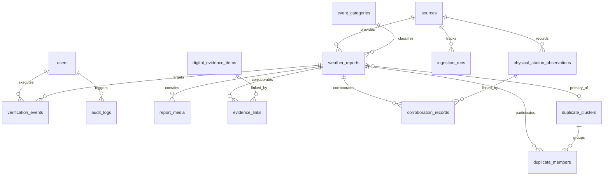

# Data Model & Entity Specifications

**Platform**: National Weather Big Data Analytics Platform (`SIH26069`)
**Status**: **FROZEN FOR SIH/MVP SCOPE** (Alembic Head: `0004_realtime_outbox_schema`)

---

## 1. Entity Relationship Overview

---

## 2. Core Entity Definitions

### 2.1 `weather_reports`
Primary domain model for crowdsourced citizen incident submissions and ingested external feeds.

| Field Name | Type | Constraints | Description |
| :--- | :--- | :--- | :--- |
| `id` | `UUID` | Primary Key, `gen_random_uuid()` | Unique report identifier |
| `tracking_id` | `VARCHAR(32)` | Unique, Not Null, Indexed | Human-readable tracking ID (`RPT-...`) |
| `source_id` | `UUID` | Foreign Key (`sources.id`), Not Null | Attributed source provider |
| `external_id` | `VARCHAR(255)` | Nullable, Indexed | External GUID / provider identifier |
| `category_id` | `UUID` | Foreign Key (`event_categories.id`), Nullable | Classified hazard category |
| `reported_category`| `VARCHAR(100)`| Nullable | Citizen-selected category |
| `severity` | `VARCHAR(20)` | Not Null, Default `'MODERATE'` | Severity level (`LOW`, `MODERATE`, `HIGH`, `SEVERE`, `CRITICAL`) |
| `title` | `VARCHAR(255)` | Not Null | Incident headline |
| `description` | `TEXT` | Nullable | Detailed incident narrative |
| `location_name` | `VARCHAR(255)` | Nullable | Landmark / street address |
| `geom` | `GEOMETRY(Point, 4326)` | Not Null | PostGIS spatial point `(longitude, latitude)` with GiST index |
| `latitude` | `DOUBLE PRECISION`| Not Null | Decimal latitude for fast serialization |
| `longitude` | `DOUBLE PRECISION`| Not Null | Decimal longitude for fast serialization |
| `occurred_at` | `TIMESTAMPTZ` | Not Null, Indexed | Incident occurrence timestamp |
| `processing_status`| `VARCHAR(30)` | Not Null, Default `'PENDING'` | Pipeline status (`QUEUED`, `PROCESSING`, `COMPLETED`, `FAILED`) |
| `verification_status`| `VARCHAR(30)`| Not Null, Default `'PENDING'`, Indexed | Triage status (`PENDING`, `UNDER_REVIEW`, `VERIFIED`, `REJECTED`, `DUPLICATE`) |
| `credibility_score`| `FLOAT` | Not Null, Default `0.0`, Range `[0.0, 1.0]`, Indexed | Calculated credibility metric |
| `credibility_explanation`| `JSONB` | Nullable | Explainable scoring breakdown |
| `raw_payload` | `JSONB` | Nullable | Full original ingestion payload |
| `created_at` | `TIMESTAMPTZ` | Not Null, Default `NOW()`, Indexed | Ingestion timestamp |
| `updated_at` | `TIMESTAMPTZ` | Not Null, Default `NOW()` | Last modification timestamp |

---

### 2.2 `report_media`
Metadata for photographic and video attachments. Binary blobs are stored in S3/MinIO; only metadata is persisted in PostgreSQL.

| Field Name | Type | Constraints | Description |
| :--- | :--- | :--- | :--- |
| `id` | `UUID` | Primary Key | Unique media identifier |
| `report_id` | `UUID` | Foreign Key (`weather_reports.id`), On Delete Cascade, Not Null | Associated report |
| `media_type` | `VARCHAR(30)` | Not Null | Type (`IMAGE`, `VIDEO`, `DOCUMENT`) |
| `storage_bucket`| `VARCHAR(100)` | Not Null | S3/MinIO bucket name (`weather-media`) |
| `storage_key` | `VARCHAR(500)` | Not Null | Object storage path key |
| `mime_type` | `VARCHAR(100)` | Not Null | MIME type (e.g., `image/jpeg`) |
| `file_size_bytes`| `BIGINT` | Not Null | File size in bytes |
| `sha256_hash` | `VARCHAR(64)` | Not Null | SHA-256 hash for tamper detection and deduplication |
| `created_at` | `TIMESTAMPTZ` | Not Null, Default `NOW()` | Upload timestamp |

---

### 2.3 `realtime_outbox`
Transactional outbox entity for guaranteed at-least-once event staging across PostgreSQL ACID boundaries.

| Field Name | Type | Constraints | Description |
| :--- | :--- | :--- | :--- |
| `id` | `UUID` | Primary Key, `gen_random_uuid()` | Unique outbox row identifier |
| `event_id` | `UUID` | Unique, Not Null, Indexed | Stable application event UUID |
| `event_type` | `VARCHAR(50)` | Not Null, Indexed | Event type (`report.created`, `report.verification_changed`, etc.) |
| `entity_id` | `VARCHAR(100)` | Not Null, Indexed | Target entity UUID |
| `tracking_id` | `VARCHAR(50)` | Nullable | Human-readable tracking ID |
| `occurred_at` | `TIMESTAMPTZ` | Not Null | Timestamp when the domain event occurred |
| `payload` | `JSONB` | Not Null | Sanitized JSON event payload |
| `status` | `VARCHAR(20)` | Not Null, Default `'PENDING'`, Indexed | Staging status (`PENDING`, `PUBLISHED`, `DEAD_LETTER`) |
| `attempts` | `INTEGER` | Not Null, Default `0` | Consecutive delivery attempts count |
| `max_attempts` | `INTEGER` | Not Null, Default `5` | Delivery attempt limit before `DEAD_LETTER` |
| `last_error` | `TEXT` | Nullable | Error traceback from last failed publish attempt |
| `next_retry_at`| `TIMESTAMPTZ` | Nullable, Indexed | Timestamp for exponential backoff retry |
| `published_at` | `TIMESTAMPTZ` | Nullable | Timestamp when published to Redis Stream |
| `created_at` | `TIMESTAMPTZ` | Not Null, Default `NOW()`, Indexed | Outbox creation timestamp |

---

### 2.4 `verification_events`
Immutable audit log of all human operator triage actions.

| Field Name | Type | Constraints | Description |
| :--- | :--- | :--- | :--- |
| `id` | `UUID` | Primary Key | Verification event identifier |
| `report_id` | `UUID` | Foreign Key (`weather_reports.id`), Not Null | Target report |
| `user_id` | `UUID` | Foreign Key (`users.id`), Nullable | Reviewing operator user ID |
| `previous_status`| `VARCHAR(30)`| Not Null | Status prior to transition |
| `new_status` | `VARCHAR(30)` | Not Null | Status after transition (`VERIFIED`, `REJECTED`, `DUPLICATE`) |
| `notes` | `TEXT` | Nullable | Officer's justification notes |
| `action_metadata`| `JSONB` | Nullable | Context metadata (broadcast flags, IP, station) |
| `created_at` | `TIMESTAMPTZ` | Not Null, Default `NOW()`, Indexed | Transition timestamp |

---

### 2.5 `duplicate_clusters` & `duplicate_members`
Spatiotemporal clustering entities ($R \le 2.5\text{ km}$, $\Delta T \le 120\text{ min}$).

#### `duplicate_clusters`
- `id` (`UUID PK`)
- `primary_report_id` (`UUID FK -> weather_reports.id`)
- `cluster_radius_meters` (`FLOAT`, default `2500.0`)
- `centroid_geom` (`GEOMETRY(Point, 4326)` with GiST index)
- `member_count` (`INTEGER`, default `1`)
- `created_at`, `updated_at` (`TIMESTAMPTZ`)

#### `duplicate_members`
- `id` (`UUID PK`)
- `cluster_id` (`UUID FK -> duplicate_clusters.id`)
- `report_id` (`UUID FK -> weather_reports.id`)
- `similarity_score` (`FLOAT`, range `[0.0, 1.0]`)
- `created_at` (`TIMESTAMPTZ`)

---

### 2.6 `digital_evidence_items` & `evidence_links`
Digital news, social media posts, and official alerts corroborated against weather reports.

- `digital_evidence_items`: External news/social items (`id`, `source_id`, `url`, `title`, `snippet`, `published_at`, `provenance_group`).
- `evidence_links`: Many-to-many relationship linking reports to digital evidence (`report_id`, `evidence_item_id`, `relationship_type`, `confidence_score`).

---

### 2.7 `physical_station_observations` & `corroboration_records`
Official Automatic Weather Station (IMD AWS) and river gauge (CWC) telemetry.

- `physical_station_observations`: Physical sensor readings (`id`, `station_code`, `station_name`, `geom`, `rainfall_mm`, `wind_speed_kmh`, `observed_at`).
- `corroboration_records`: Spatial-temporal links between weather reports and sensor observations (`report_id`, `observation_id`, `delta_distance_km`, `delta_time_minutes`, `corroboration_score`).

---

## 3. Spatial & Relational Indexing Strategy

1. **Spatial PostGIS GiST Indexes**:
   - `idx_weather_reports_geom`: `USING GIST (geom)`
   - `idx_weather_observations_geom`: `USING GIST (geom)`
   - `idx_duplicate_clusters_centroid`: `USING GIST (centroid_geom)`
2. **Outbox Batch Claiming Index**:
   - `idx_realtime_outbox_pending_retry`: `(status, next_retry_at, created_at)`
   - `idx_realtime_outbox_event_id`: `(event_id)`
3. **Temporal & Filter Indexes**:
   - `idx_weather_reports_status_time`: `(verification_status, occurred_at DESC)`
   - `idx_weather_reports_credibility`: `(credibility_score DESC)`
   - `idx_weather_reports_tracking_id`: `(tracking_id)`
