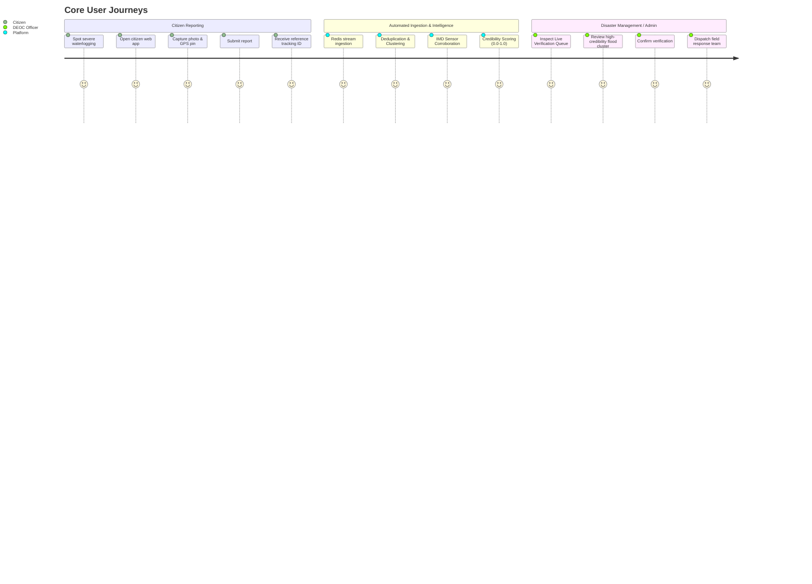

# Product Requirements Document (PRD)

**Project Title**: National Weather Big Data Analytics Platform  
**Smart India Hackathon 2026 — Problem Statement ID**: `SIH26069`  
**Category**: Big Data Analytics / Disaster Management / Public Safety  
**Target Beneficiaries**: National & State Disaster Response Forces (NDRF, SDRF), District Emergency Operations Centers (DEOCs), Municipal Corporations, Meteorological Analysts, and the General Public.

---

## 1. Executive Summary & Problem Context
Extreme weather phenomena (flash floods, urban waterlogging, cloudbursts, severe cyclonic storms, heatwaves, and hailstorms) have escalated in frequency and localized severity across India. While the India Meteorological Department (IMD) maintains advanced Doppler weather radars, satellite feeds, and Automatic Weather Stations (AWS), hyper-local micro-climate events often unfold at spatial scales smaller than the sensor grid.

Simultaneously, citizens and local responders on the ground capture real-time observations and imagery, yet this crowdsourced data suffers from noise, misinformation, duplicates, and lack of meteorological validation. 

The **National Weather Big Data Analytics Platform (SIH26069)** solves this gap by synthesizing official government meteorological data, public feeds, and citizen crowdsourced reports into a unified, high-throughput intelligence pipeline. The platform performs real-time ingestion, AI-driven event classification, spatial-temporal deduplication, explainable credibility scoring, and geospatial visualization for rapid administrative verification and emergency response.

---

## 2. Requirement Classification Framework
To maintain rigorous documentation integrity, all platform requirements are divided into four distinct tiers:

```
┌───────────────────────────────────────────────────────────┐
│ 1. Explicit SIH Requirements (Foundational Mandate)       │
├───────────────────────────────────────────────────────────┤
│ 2. Submitted Solution Concepts (Baseline Product Concept) │
├───────────────────────────────────────────────────────────┤
│ 3. Engineering Decisions for MVP (Pragmatic Scope)        │
├───────────────────────────────────────────────────────────┤
│ 4. Future Scalability & Production Extensions             │
└───────────────────────────────────────────────────────────┘
```

---

## 3. Scope & Requirement Breakdown

### Tier 1: Explicit SIH Requirements
- **Big Data Analytics Engine**: Ability to ingest, process, and analyze heterogeneous weather data streams from multiple sources at scale.
- **National Scale Geospatial Processing**: High-performance querying of spatial coordinates, bounding boxes, administrative boundaries, and proximity radii across Indian states and districts.
- **Decision Support for Disaster Management**: Provide actionable intelligence, severity metrics, and early trend detection for disaster response bodies.

### Tier 2: Submitted Solution Baseline Concepts
- **Citizen Weather & Event Reporting**: Simple, accessible citizen portal for submitting real-time reports with photo/video media, exact geolocation (GPS / map pin), hazard category, and observed severity.
- **Multi-Source Ingestion**: Ingestion of IMD weather station observations, alerts, open data portals (e.g., data.gov.in), RSS feeds, and internet sources.
- **Intelligence & Triage Pipeline**:
  - Automated syntactic and semantic validation.
  - Event classification (e.g., Flood, Urban Waterlogging, Severe Thunderstorm, Cyclone, Landslide, Heatwave).
  - Spam and anomaly detection.
  - Duplicate detection and spatial-temporal clustering of co-located reports.
  - Explainable credibility scoring based on source trust, multi-source corroboration, and consistency.
  - Corroboration against nearby IMD sensor readings.
- **Centralized Data Storage**: Unified repository with spatial indexing for spatial querying and time-series aggregation.
- **Real-Time Interactive Dashboard**:
  - Dynamic Map Explorer displaying live events, heatmaps, severity pins, and clusters.
  - Multi-dimensional filtering (Date/Time Range, Event Category, Severity Level, Geospatial Bounds, Verification State).
  - KPI cards, temporal trends, and regional risk summaries.
- **Administrative Verification Queue**:
  - Dedicated workflow for authorized disaster management officers (NDRF/DEOC).
  - Side-by-side evidence inspection (photos, sensor readings, AI credibility breakdown).
  - Triage actions: Verify, Reject, Flag Duplicate, or Escalate.

### Tier 3: Engineering Decisions for MVP (Current Build Scope)
- **Primary System of Record**: PostgreSQL 16+ with PostGIS spatial extension.
- **Media Storage**: S3-compatible Object Storage (MinIO locally) with signed URLs; zero binary media in relational tables.
- **Event Streaming & Coordination**: Redis Streams for decoupled asynchronous ingestion workers and pub/sub notifications.
- **Explainable Credibility Scoring Algorithm**: Transparent, formulaic multi-factor calculation combining Source Weight ($W_{src}$), Spatial-Temporal Clustering Consensus ($W_{cluster}$), IMD Sensor Proximity Corroboration ($W_{sensor}$), and Media Evidence Weight ($W_{media}$).
- **State Machine for Verification**: Explicit states: `PENDING`, `UNDER_REVIEW`, `VERIFIED`, `REJECTED`, `DUPLICATE`.
- **Lightweight AI / NLP**: Local embeddings (e.g., Sentence Transformers / FastEmbed) for duplicate semantic grouping and cosine similarity, plus rule-based classification heuristics. LLM invocation reserved only for ambiguous classification or natural-language summary generation.
- **Single Monorepo Architecture**: Clean separation between `/front-end` (React + Vite + Tailwind + shadcn/ui) and `/back-end` (FastAPI + SQLAlchemy 2.0 Async + Pydantic v2).

### Tier 4: Future Scalability & Production Extensions
- **Enterprise Messaging**: Seamless migration from Redis Streams to Apache Kafka or Redpanda for multi-gigabyte/sec national streams.
- **Multimodal Deep Learning**: Fine-tuned Vision-Language Models (VLM) for automated flood depth estimation and storm damage assessment from citizen photos.
- **CAP (Common Alerting Protocol) Integration**: Automated outbound dissemination to NDMA SACHET portal and telecom SMS cell broadcasts.
- **IoT Edge Sensor Mesh**: Direct MQTT/CoAP telemetry ingestion from solar-powered IoT river-level and micro-AWS sensors.

---

## 4. User Personas & Core Workflows



### Persona 1: The Citizen / Community Observer
- **Goal**: Quickly report a severe localized weather event (e.g., knee-deep waterlogging, fallen trees blocking roads, flash flood) without cumbersome registration.
- **Key Needs**: Fast loading on mobile browsers, automatic GPS capture, simple image upload, immediate visual confirmation, and tracking ID.

### Persona 2: District Emergency Operations Center (DEOC) Officer / First Responder
- **Goal**: Gain real-time situational awareness across their administrative jurisdiction, prioritize response deployments, and avoid wasting resources on hoaxes.
- **Key Needs**: Filterable map dashboard, automated incident clustering, instant display of IMD radar/sensor data alongside citizen photos, and one-click verification triage.

### Persona 3: State Meteorological / Disaster Management Analyst
- **Goal**: Analyze historical event trends, evaluate sensor coverage gaps, and audit model credibility accuracy.
- **Key Needs**: Aggregated time-series charts, severity distribution breakdowns, raw data export, and source reliability audit logs.

---

## 5. Non-Functional Requirements (NFRs)

| Dimension | Target Specification |
| :--- | :--- |
| **Ingestion Latency** | End-to-end ingestion and initial scoring in $< 1.5\text{ seconds}$ under standard load. |
| **Map Rendering** | Leaflet viewport rendering of up to $5,000$ spatial markers using vector clustering in $< 500\text{ ms}$. |
| **Availability & Resilience** | Pluggable adapter isolation; failure of an external API (e.g., IMD portal timeout) must not block citizen ingestion or dashboard availability. |
| **Data Integrity** | Zero data loss for accepted citizen submissions; media checksums (SHA-256) stored for auditability. |
| **Security & Privacy** | Redaction of citizen PII (phone/IP) from public dashboard views; role-based access control (RBAC) with JWT for administrative verification actions. |
